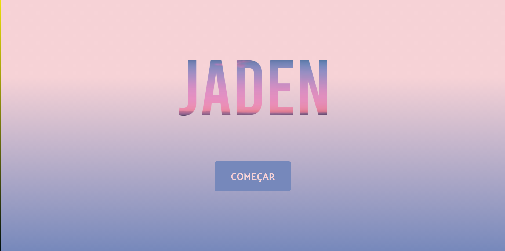
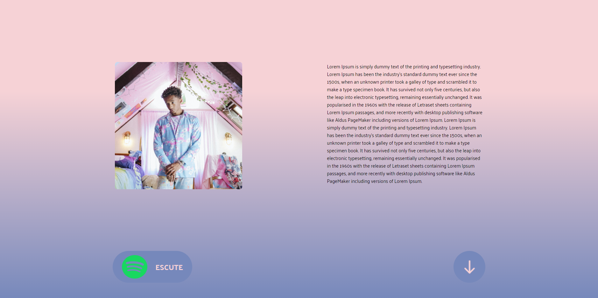
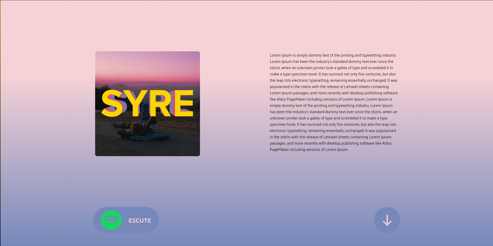
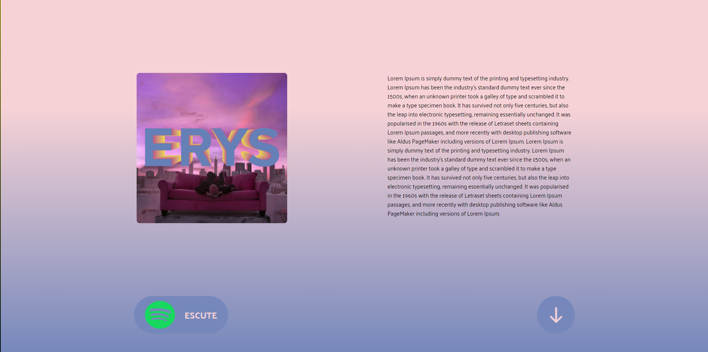
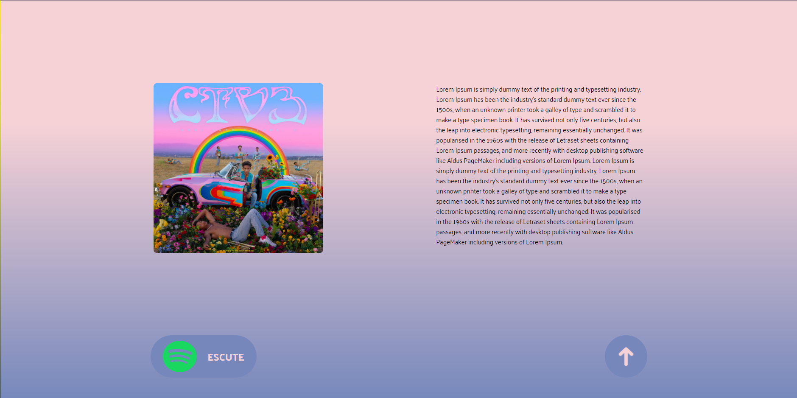
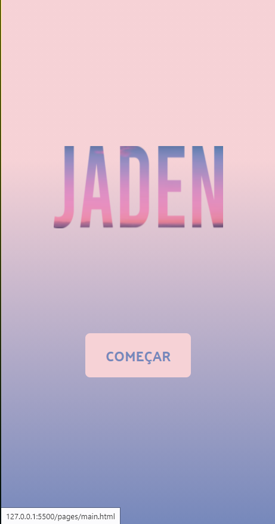
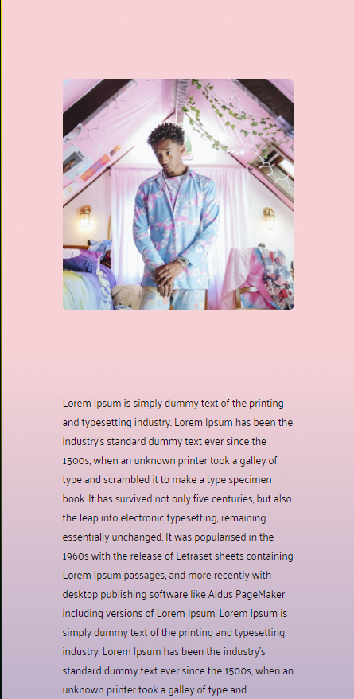
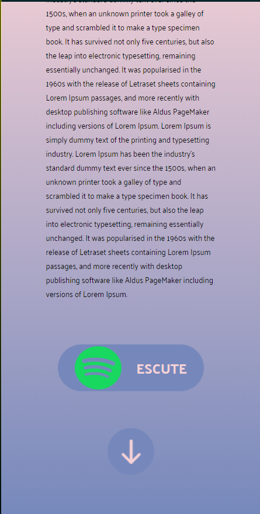

## Conteúdos

    <a href="#Sobre">&#128187 Sobre</a> •
    <a href="#Tecnologias">Tecnologias</a> •
    <a href="#Implementaçoes futuras">Implementações futuras</a> •
    <a href="#Aparência Web">Aparência Web</a> •
    <a href="#Aparência Mobile">Aparência Mobile</a> •
    <a href="#Licença">Licença &#128187</a> 

### Sobre

O projeto consiste em um site de tributo para um exercício do freecodecamp, então eu fiz sobre um cantor que eu sou bastante fã. O site é dividido entre os álbums principais do Jaden e uma introdução geral sobre a vida dele, cada álbum contém uma resenha sobre o mesmo e um botão que leva ao spotify para que o leitor possa escutar as músicas. Foi feito com responsividade para telas com resolução de 1080p, 720p e mobile.

### Tecnologias

- HTML
- CSS

### Implementações futuras

- [x] Animações simples
- [ ] Animações complexas
- [ ] Resenhas

### Aparência Web

### Aparência Mobile

### Licença 

- <a href="LICENSE">MIT License</a>

### Feito com :black_heart: por Juarez Goulart.

